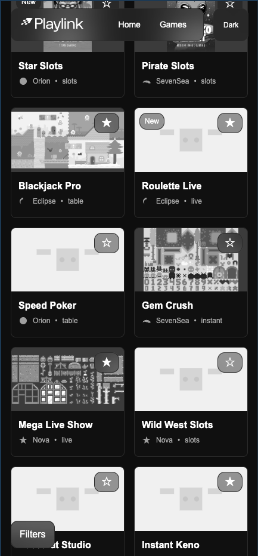

## Playlink Game Library (POC)

A polished, responsive Game Library demo built with React 19, Vite 6, and TypeScript 5. It showcases a modern design system, strong accessibility (WCAG AA), smooth micro‑interactions, and pragmatic architecture choices suited for a real-world frontend codebase.

### Tech Stack

- React 19, TypeScript 5, Vite 6
- React Router v7 (data APIs), Context API for app state
- SCSS Modules + CSS Variables (prefixed `--pl-*`) + Tailwind v4 utilities
- Mock API via static JSON, custom hooks for data and syncing

---

## Design System Overview

The UI is token‑driven and themeable (light/dark). Global CSS variables encapsulate foundations (color, spacing, typography, motion) and are consumed by SCSS modules and Tailwind utilities.

### Tokens

- Colors, surfaces, and text are defined as CSS variables and toggled in `.theme-dark`.
- Typography scales, spacing, radii, shadows, and motion are unified across components.

#### Colors & Surfaces

| Token                         | Value                                                     |
| ----------------------------- | --------------------------------------------------------- |
| `--pl-color-bg`               | light: `var(--pl-white)`; dark: `#0e0e0e`                 |
| `--pl-color-surface`          | light: `#f7f7f7`; dark: `var(--pl-card-grey)`             |
| `--pl-color-surface-2`        | light: `#e6e6e6`; dark: `var(--pl-second-grey)`           |
| `--pl-color-border`           | light: `#d1d1d1`; dark: `#2a2a2a`                         |
| `--pl-color-text`             | light: `#1a1a1a`; dark: `var(--pl-white)`                 |
| `--pl-color-text-muted`       | light: `#666`; dark: `#aaa`                               |
| `--pl-color-primary`          | light: `#4a4a4a`; dark: `#999`                            |
| `--pl-color-primary-contrast` | light: `var(--pl-white)`; dark: `var(--pl-black)`         |
| Provider logos                | `--pl-provider-logo-filter`, `--pl-provider-logo-opacity` |

#### Overlay Surfaces

| Token                                | Value        |
| ------------------------------------ | ------------ |
| `--pl-color-surface-overlay-1`       | `#f7f7f769`  |
| `--pl-color-surface-overlay-2`       | `#f7f7f733`  |
| `--pl-color-surface-overlay-3`       | `#f7f7f71a`  |
| `--pl-color-surface-backdrop-blur-1` | `blur(4px)`  |
| `--pl-color-surface-backdrop-blur-2` | `blur(12px)` |
| `--pl-color-surface-backdrop-blur-3` | `blur(24px)` |

(Dark theme overrides provide equivalent tokens with dark values.)

#### Typography

| Token            | Value                          |
| ---------------- | ------------------------------ |
| `--pl-font-sans` | `Fkdisplay, Arial, sans-serif` |
| `--pl-fs-sm`     | 14px                           |
| `--pl-fs-md`     | 16px                           |
| `--pl-fs-lg`     | 18px                           |
| `--pl-fs-xl`     | 22px                           |
| `--pl-lh-normal` | 1.4                            |

#### Spacing

| Token          | Value |
| -------------- | ----- |
| `--pl-space-1` | 4px   |
| `--pl-space-2` | 8px   |
| `--pl-space-3` | 12px  |
| `--pl-space-4` | 16px  |
| `--pl-space-6` | 24px  |
| `--pl-space-8` | 32px  |

#### Radii & Shadows

| Token            | Value                      |
| ---------------- | -------------------------- |
| `--pl-radius-sm` | 4px                        |
| `--pl-radius-md` | 8px                        |
| `--pl-radius-lg` | 12px                       |
| `--pl-shadow-1`  | 0 2px 8px rgba(0,0,0,.08)  |
| `--pl-shadow-2`  | 0 6px 18px rgba(0,0,0,.16) |

#### Motion

| Token                   | Value                              |
| ----------------------- | ---------------------------------- |
| `--pl-ease`             | `ease`                             |
| `--pl-elastic-ease-out` | soft elastic used for color‑reveal |
| `--pl-dur-fast`         | 120ms                              |
| `--pl-dur-med`          | 300ms                              |

### Styling Approach: SCSS + CSS Variables + Tailwind

- CSS Variables provide themeable tokens and runtime overrides (e.g., `.theme-dark`).
- SCSS Modules encapsulate component styles with strong co-location and zero leakage.
- Tailwind v4 utilities accelerate layout and spacing without sacrificing readability.
- This hybrid approach gives the ergonomics of utilities, the power of tokens, and maintainable component styles.

Why not styled‑components?

- Critical styles depend on CSS variables and media queries (e.g., reduced motion) at the global layer.
- SCSS Modules keep the CSS output lean, tooling simple (no runtime JS styling), and DX excellent.

---

## Screenshots (placeholders)

- Light mode:

  

- Dark mode:

  

- Mobile View (dark):

  

- Loading (skeletons) (light):

  

- Loading (skeletons) (dark):

  

- Error state (light):

  

- Error state (dark):

  

- Mobile Filters Drawer:

  

---

## Key Design Decisions

- SCSS + Variables + Tailwind over styled‑components for simplicity, performance, and themeability.
- Context API for app state (filters, favorites): small shared state, no need for external libs.
- Router v7 for a clean, future‑proof route setup and modern navigation APIs.
- UX: grayscale→color thumbnails on hover/focus, skeletons instead of spinners, a mobile bottom drawer for filters.

---

## Technical Architecture

### File Structure (excerpt)

```text
src/
  app/
    layout/RootLayout.tsx
    routes.tsx
  components/
    GameCard.tsx
    CardSkeleton.tsx
    SearchBar.tsx
    FilterChips.tsx
    MobileFilterDrawer.tsx
    GridSizeSwitch.tsx
    Logo.tsx
  context/
    GameContext.tsx
  hooks/
    useGames.ts
    useFilterQuerySync.ts
    useMediaQuery.ts
  pages/
    GamesPage.tsx
  styles/
    index.scss
    tokens.scss
    base.scss
```

### Context + Hooks

- `GameContext`: filters and favorites with persistence.
- `useGames`: fetches mock data with delay, derives metadata, filters on the client, exposes `refetch()` without reloading the page, and a shared in‑flight cache.
- `useFilterQuerySync`: hydrates from URL on load and debounces URL updates.
- `useMediaQuery`: responsive helpers (e.g., grid columns).

### SCSS Modules

- Each component has a `.module.scss` for encapsulated styles, leveraging tokens and Tailwind utilities.

---

## Performance Decisions

- Lazy images with `loading="lazy"`, `decoding="async"`, and responsive `sizes`.
- Debounced search input and debounced URL syncing.
- In‑module shared cache + in‑flight promise in `useGames` to prevent duplicate fetches.
- Memoized computations for filtered results and derived metadata.
- Skeletons render stable placeholders to reduce layout shift.

---

## Component Hierarchy & Reusability

- `GamesPage` composes:
  - `SearchBar` + result count
  - Desktop: `FilterChips` + `GridSizeSwitch`
  - Mobile: `MobileFilterDrawer` + `GridSizeSwitch`
  - Content area: `CardSkeleton` during loading; `GameCard` grid when data is ready
- `GameCard` encapsulates thumbnail, metadata, provider logo, and favorite toggle with micro‑interactions.
- `CardSkeleton` mirrors `GameCard` layout with staggered pulse and reduced‑motion support.

---

## Accessibility

- Roles/ARIA: theme `role="switch"`; chips and favorite use `aria-pressed`; drawer `role="dialog"` with `aria-modal` and `aria-labelledby`; results announce via `aria-live="polite"`.
- Focus: custom `.focus-ring` visible only on keyboard navigation; ESC closes drawer and restores focus.
- Motion: `prefers-reduced-motion` removes hover lift translation and staggers.
- Contrast: token-driven colors meet AA in light/dark.
- Touch targets: all controls ≥ 44×44px.

---

## Mobile Design

- Filters as a bottom drawer with focus trap and ESC to close.
- Responsive grid with persistent column count (1/2 on mobile, 2/3/4 on desktop) stored in `localStorage`.
- Grid control disabled during error states; favorites chip stays enabled during loading only if there are results.

---

## What I’d improve with more time

1. Improve mobile navigation, drawer, and filtering — consolidate into a dedicated filter component.
2. Expand CSS variable usage into a more thoughtful, extensible system.
3. Implement lazy loading for games and refine service mechanics.
4. Create a richer mobile menu and improve mobile state overall.
5. Review and refine desktop filtering UX for clarity and speed.
6. Establish clearer distinction between primary vs. secondary actions, possibly add an accent color to guide users.

---

## Setup Instructions

### Prerequisites

- Node.js 18+ recommended.

### Install & Run

```bash
npm install
npm run dev
# open http://localhost:5173
```

### Build & Preview

```bash
npm run build
npm run preview
```

### Docker (optional)

```bash
# from repo root
docker build -t playlink-games .
docker run --rm -p 5173:5173 playlink-games
```

---

## Tips for Success (assessment alignment)

- Design first; keep users at the center.
- Polish matters: micro‑interactions, consistent loading, and perceived performance.
- Mobile is first‑class: ensure responsive UX and accessible touch targets.

---

## Bonus Features Achieved

- Dark mode with smooth transition.
- Skeletons with stagger and reduced‑motion handling.
- Micro‑interactions: hover lift, favorite pop, theme swap.
- Persistence: favorites (`pl-favorites`), grid size (`pl-grid-cols`).
- URL query sync for shareable filter state.

---

## Error State Testing & Refetch

- Temporary error simulation in `src/hooks/useGames.ts`:
  - Toggle `const FORCE_ERROR = true;` or append `?forceError=1` to the URL.
- The hook exposes `refetch()` to reload data without a full page refresh (clears in‑memory cache, updates loading/error states).
- Favorites chip remains clickable during loading only if there are results; disabled on error.
- Grid size selector is disabled on error to avoid confusing controls.

---

## Runbook (Demo Walkthrough)

1. Show the design system and toggle dark mode; point out token‑driven colors and transitions.
2. Use filters (desktop chips and mobile drawer), and highlight URL syncing as filters change.
3. Trigger loading/error using `FORCE_ERROR` or `?forceError=1`; show skeletons and error UI; use `refetch()` retry.
4. Favorite a few games, refresh the page, and show favorites persistence.
5. Highlight accessibility: keyboard navigate chips and favorite toggles, ESC to close drawer, visible focus rings, and reduced‑motion behavior.
